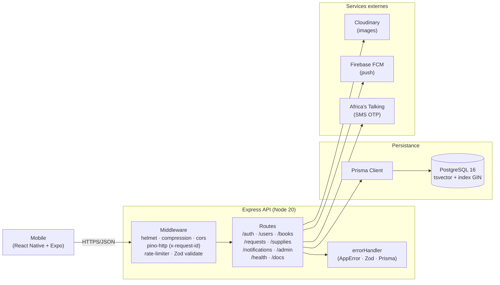

# BookSwap

[](https://github.com/bslik001/bookswap/actions/workflows/ci.yml)
[](.nvmrc)

Application mobile d'echange de livres scolaires. Les eleves et parents
publient les manuels qu'ils souhaitent echanger, un administrateur facilite
la mise en relation, et les fournisseurs proposent des fournitures scolaires.

## Documentation

| Document | Description |
|----------|-------------|
| [Cahier d'analyse](CAHIER_ANALYSE.md) | Cas d'utilisation, modele de donnees, regles de gestion |
| [Cahier de conception](CAHIER_CONCEPTION.md) | Architecture technique, schema Prisma, contrats API, specs UI |
| [Cahier de conception frontend](CAHIER_CONCEPTION_FRONTEND.md) | Architecture mobile React Native/Expo, ecrans, strategies transverses |
| [Maquettes](maquettes.html) | 12 ecrans interactifs (ouvrir dans un navigateur en mode mobile) |
| [CHANGELOG](CHANGELOG.md) | Historique des versions |
| [README API](server/README.md) | Backend Express + Prisma + PostgreSQL |
| [README mobile](mobile/README.md) | App React Native + Expo |
| **API interactive** | Swagger UI sur `/api/docs` une fois le serveur lance |

> Le cahier des charges initial (PDF) est conserve hors versionnement
> (cf. [.gitignore](.gitignore)).

## Architecture



Le client mobile attaque l'API Express, qui passe par une chaine de
middlewares (securite, observabilite, validation) avant d'atteindre les
routes metier. Les controllers deleguent a Prisma pour la base et aux SDK
externes pour les images, push et SMS.

## Structure du monorepo

```
bookswap/
├── .github/workflows/ci.yml        # Pipeline CI
├── .husky/                         # Hooks Git (pre-commit, commit-msg)
├── docker-compose.yml              # Postgres + API (dev)
├── render.yaml                     # Blueprint deploiement Render
├── server/                         # API Express + Prisma — cf. server/README.md
└── mobile/                         # App React Native + Expo — cf. mobile/README.md
```

## Quick start

```bash
# Installer les hooks Git du monorepo
npm install

# Backend (Postgres + API en Docker, hot reload)
cd server && npm ci && cd ..
docker compose up -d

# App mobile
cd mobile
npm install
cp .env.example .env
npm start
```

Details d'install, env et tests par sous-projet :
- **API** → [server/README.md](server/README.md)
- **Mobile** → [mobile/README.md](mobile/README.md)

## Conventions

- **Commits** — [Conventional Commits](https://www.conventionalcommits.org/)
  obligatoires (verifies par commitlint via le hook `commit-msg`).
- **Lint / format** — `pre-commit` execute automatiquement
  ESLint + Prettier sur les fichiers stages (lint-staged).
- **Branches** — `main` deployee en continu sur Render. Les PR
  declenchent la CI (lint + typecheck + tests + prisma validate).
